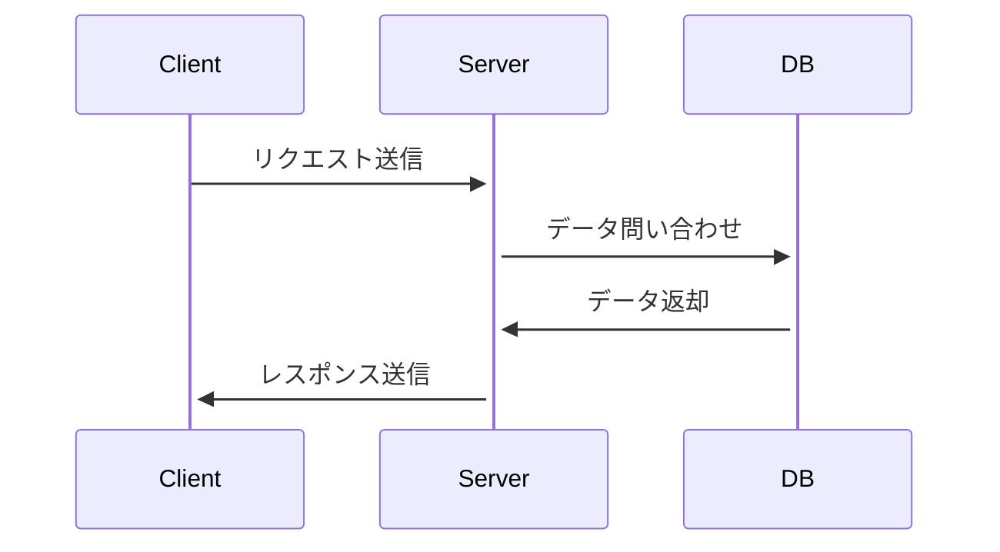

# シーケンス図

```mermaid
sequenceDiagram
    participant Client
    participant Server
    participant DB

    Client->>+Server: リクエスト送信
    Server->>+DB: データ問い合わせ
    DB->>+Server: データ返却
    Server->>+Client: レスポンス送信
```
