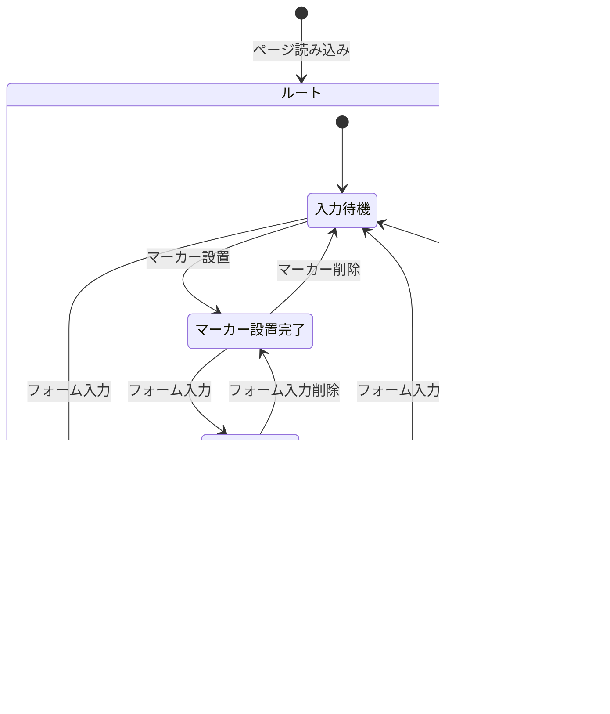

# 状態遷移図

```mermaid
stateDiagram-v2
    [*] --> ルート:ページ読み込み

    state ルート {
        [*] --> 入力待機
        入力待機 --> マーカー設置完了:マーカー設置
        入力待機 --> フォーム入力完了:フォーム入力
        マーカー設置完了 --> 投稿準備完了:フォーム入力
        マーカー設置完了 --> 入力待機:マーカー削除
        フォーム入力完了 --> 投稿準備完了:マーカー設置
        フォーム入力完了 --> 入力待機:フォーム入力削除
        投稿準備完了 --> フォーム入力完了:マーカー削除
        投稿準備完了 --> マーカー設置完了:フォーム入力削除
        投稿準備完了 --> 投稿処理待機:投稿
        投稿処理待機 --> 入力待機:登録処理終了
    }

    ルート --> [*]: ページクローズ
```
