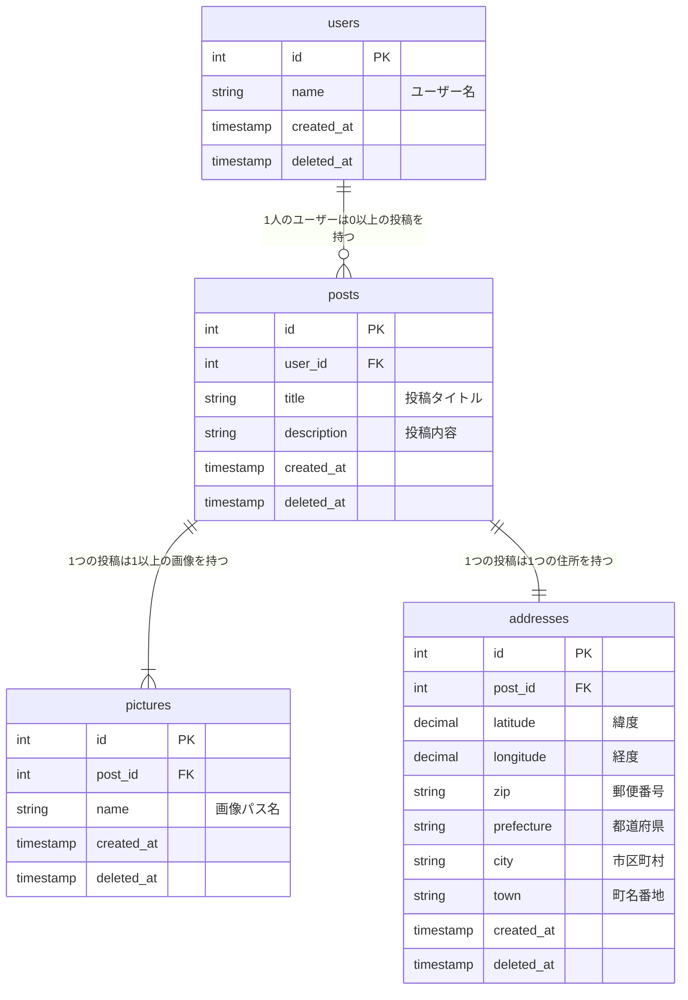

# テーブル設計

```mermaid
erDiagram
    users ||--o{ posts : "1人のユーザーは0以上の投稿を持つ"
    posts ||--|{ pictures : "1つの投稿は1以上の画像を持つ"
    posts ||--|| addresses : "1つの投稿は1つの住所を持つ"

    users {
        int id PK
        string name "ユーザー名"
        timestamp created_at
        timestamp deleted_at
    }

    posts {
        int id PK
        int user_id FK
        string title "投稿タイトル"
        string description "投稿内容"
        timestamp created_at
        timestamp deleted_at
    }

    pictures {
        int id PK
        int post_id FK
        string name "画像パス名"
        timestamp created_at
        timestamp deleted_at
    }

    addresses {
        int id PK
        int post_id FK
        decimal latitude "緯度"
        decimal longitude "経度"
        string zip "郵便番号"
        string prefecture "都道府県"
        string city "市区町村"
        string town "町名番地"
        timestamp created_at
        timestamp deleted_at
    }
```
