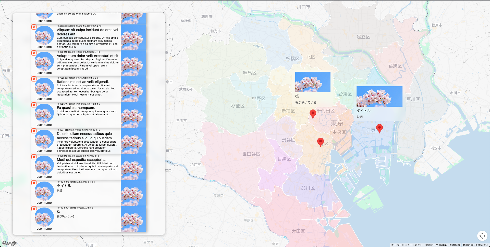

# 概要

GoogleMapsAPIによる位置情報を用いたSNS風アプリケーション

## アプリイメージ



## 使用技術


## 環境構築(整備中)

### 1. リポジトリをクローン

### 2. .env を作成

```bash
cp www/html/.env.example www/html/.env
```

### 3. 起動

```bash
docker compose up -d
```

### 4. Laravel の初期設定

```bash
docker compose exec app bash
cd /var/www/html
composer install
php artisan key:generate
php artisan migrate
composer require laravel/breeze --dev
php artisan breeze:install react
```

### 5. フロントエンドのインストール（ローカル）

```bash
cd www/html
npm install
npm run dev
```

### 6. マイグレーション

```bash
docker compose exec app bash
cd /var/www/html
php artisan migrate
```

### 7. 確認

- <http://localhost>
- <http://localhost/login>
- <http://localhost/register>
